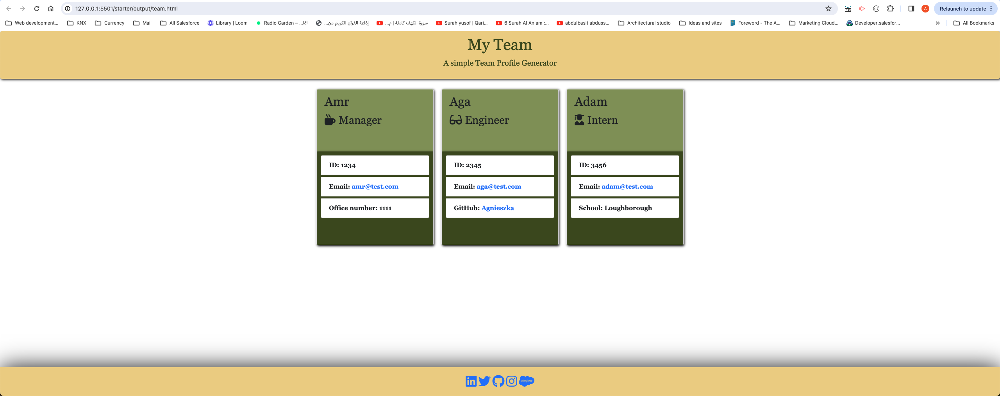
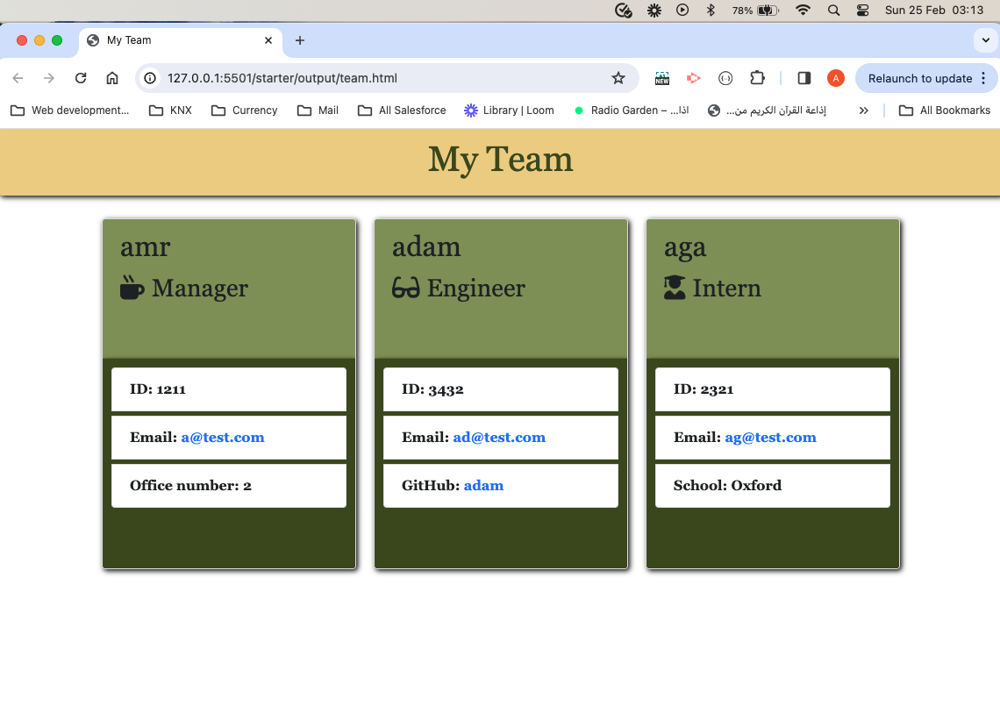
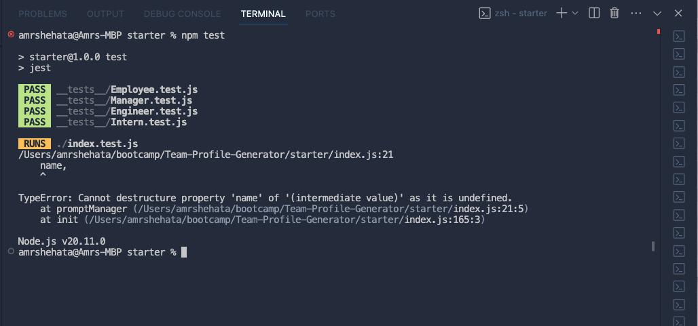

# Team-Profile-Generator

The challenge is to create an application that generates HTML files using input from a command-line interface.

This application will take in information about employees on a software engineering team, then generate an HTML webpage that displays summaries for each person.  

## Skills used / learned :
- Creating classes and working with Constructor functions
- Using inquirer to gather information about the team and create objects for each member of the team
- Generating HTML once the application is exited.
- Installing inquirer and jest to import/export and test functionalities

### Deployed URL : 
- 

### CREDIT:
Please Note: I have learned so much during implementing this challenge given my early stages of developments with the huge aid of the following contributors:

ChatGPT: https://chat.openai.com/  
How to validate answers to questions for inquirer / jest and test.js files creations?  
CSS styling  
Troubleshooting errors that appeard in the console and during testing  
Classes recording :  
Functions and variables creations  
W3School  

### Resources:
• W3School • ChatGPT • Google search engines • Classes recordings, activities and notes

### Installation:  
• As a developer who wishes to access the back-end files for this page, you will need to access GitHub to be able to open the repo via the following link: " https://github.com/WFlorida2/Team-Profile-Generator "
* fork / clone the files and run from your machine

#### End results Walkthough Video:

https://www.capcut.com/s/Cbiu5-nYJk0HUC4V/

#### End results images:

